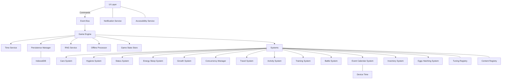
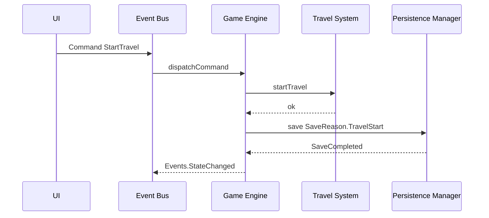
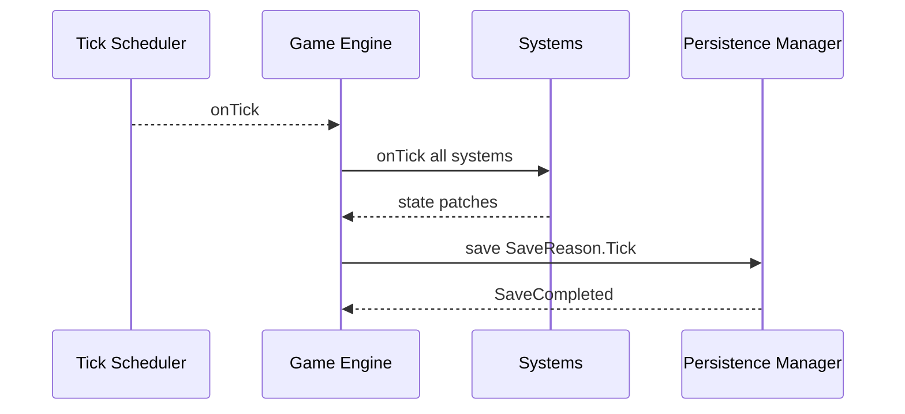
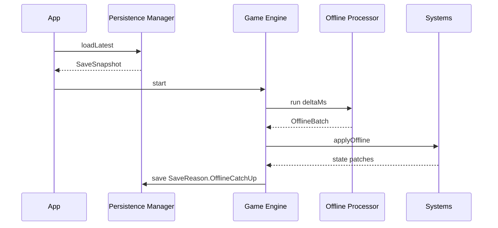
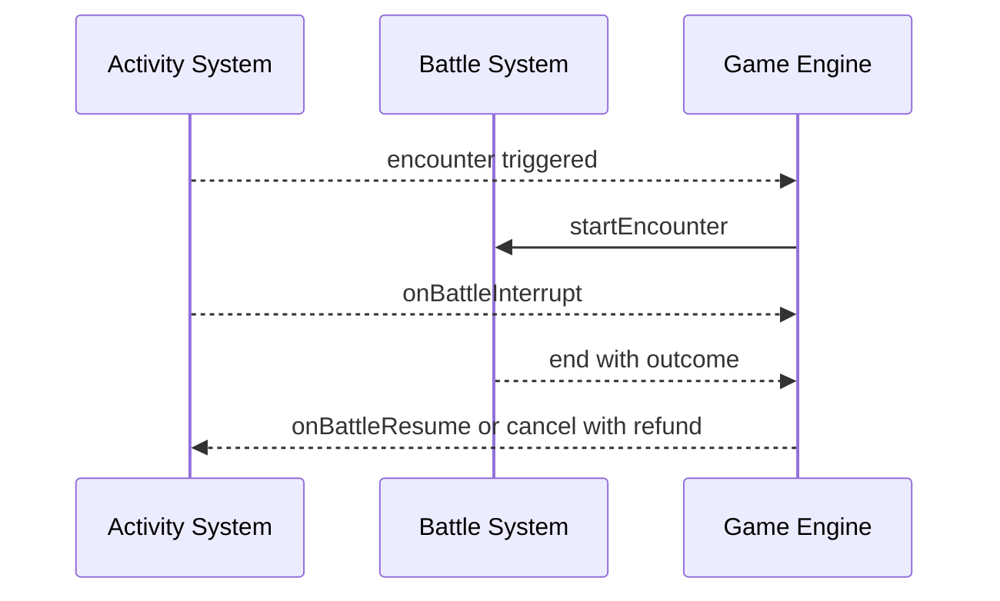
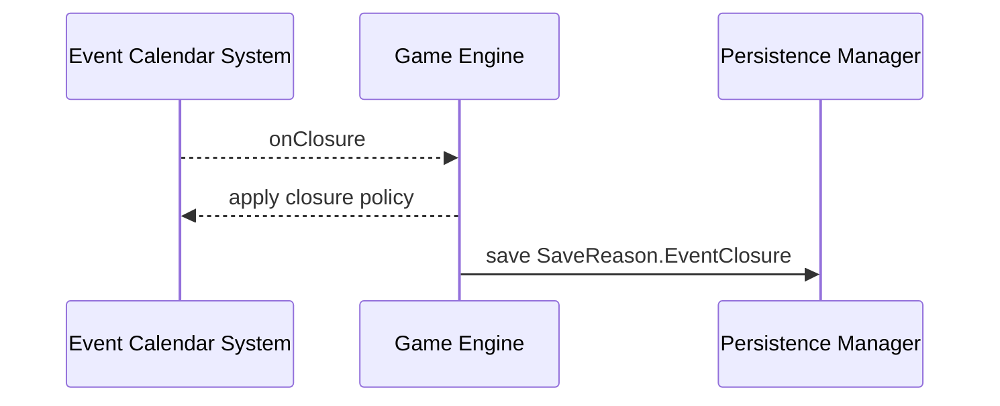

# Digital Pet Game Architecture

Scope: Client only, offline capable, tick driven. This document defines components, their roles, and how they interact, from high level to function level. It emphasizes a GameEngine as central coordinator, a 60s tick cadence for periodic updates and autosave, plus transactional autosaves on critical user actions such as starting travel, using items, or beginning sleep, to prevent progress loss between ticks.

## High Level Overview

- GameEngine orchestrates initialization, ticking, offline catch up, autosaves, and cross system coordination.
- Systems encapsulate domain logic: Care, Hygiene, Status, Energy and Sleep, Growth, Travel, Activities, Training, Battle, Calendar Events, Inventory and Shops, Eggs and Hatching, Concurrency.
- Services provide cross cutting capabilities: TimeService and TickScheduler, PersistenceManager for IndexedDB, RNGService, EventBus, NotificationService, AccessibilityService, TuningRegistry and ContentRegistry, OfflineProcessor.
- GameStateStore is a single source of truth for all runtime state; mutations occur via explicit Commands and produce Events; systems react to Events and Tick.

## Component Topology

Notes:
- UI issues Commands; EventBus decouples UI, Engine, and Systems.
- GameEngine coordinates Time, Tick, Offline processing, Save IO, and dispatch sequencing.
- Systems read and write GameState via GameStateStore with immutable updates.

## GameEngine

Role: Central coordinator of lifecycle, ticking, autosave, offline catch up, and cross system sequencing and concurrency enforcement.

Responsibilities:
- Initialize services and systems.
- Load save, migrate if needed, run offline catch up.
- Start TickScheduler at 60s cadence.
- Execute per tick pipeline: compute deltas, apply systems, persist autosave, emit UI update events.
- Enforce autosave on critical user initiated actions to avoid data loss between ticks.
- Route Commands from UI into domain specific systems; enforce concurrency rules globally.

Key methods:
- [GameEngine.start(): Promise<void>](src/engine/GameEngine.ts:1)
- [GameEngine.stop(): Promise<void>](src/engine/GameEngine.ts:2)
- [GameEngine.handleCommand(cmd: Command): Promise<void>](src/engine/GameEngine.ts:3)
- [GameEngine.onTick(now: number): Promise<void>](src/engine/GameEngine.ts:4)
- [GameEngine.processOffline(fromTs: number, toTs: number): Promise<void>](src/engine/GameEngine.ts:5)
- [GameEngine.autosave(reason: SaveReason): Promise<void>](src/engine/GameEngine.ts:6)
- [GameEngine.registerSystem(system: System): void](src/engine/GameEngine.ts:7)
- [GameEngine.setConcurrencyManager(cm: ConcurrencyManager): void](src/engine/GameEngine.ts:8)

Tick pipeline:
1. Read current time from TimeService.
2. Build TickContext with elapsed time, tick index, and current GameState snapshot.
3. Sequentially invoke each System.onTick() with TickContext.
4. Collect mutations into a batched state update; commit to GameStateStore atomically.
5. Persist autosave with SaveReason.Tick.
6. Emit UI updates via EventBus.

Critical autosave triggers (transactional, immediate):
- Start or cancel of Travel, Activity, Training, Sleep; Force wake; Finish sleep.
- Use item, Feed, Drink, Play, Clean Poop.
- Start or end Battle; Battle outcome resolution.
- Stage advancement; Egg hatch; Inventory changes including purchases.
- Join or exit Event; Event closure resolution.
- Export or import save; Settings changes.

## Services

### TimeService and TickScheduler

Role: Provide device time abstraction and schedule 60s ticks with visibility pause handling.

Contracts:
- [TimeService.now(): number](src/services/TimeService.ts:1)
- [TickScheduler.start(intervalMs: number, cb: (now: number) => void): void](src/services/TickScheduler.ts:1)
- [TickScheduler.stop(): void](src/services/TickScheduler.ts:2)
- [TickScheduler.setVisibilityProvider(fn: () => boolean): void](src/services/TickScheduler.ts:3)

Notes:
- Pause or throttle ticks when tab hidden to reduce CPU, but retain logical time via OfflineProcessor on resume.
- Always schedule logical 60s ticks; if some are missed, GameEngine.processOffline() will flatten elapsed time on resume.

### PersistenceManager

Role: Own IndexedDB schema, reads, writes, backups, and version migrations.

Contracts:
- [PersistenceManager.loadLatest(): Promise<SaveSnapshot>](src/persistence/PersistenceManager.ts:1)
- [PersistenceManager.save(snapshot: SaveSnapshot, reason: SaveReason): Promise<void>](src/persistence/PersistenceManager.ts:2)
- [PersistenceManager.backup(snapshot: SaveSnapshot): Promise<void>](src/persistence/PersistenceManager.ts:3)
- [PersistenceManager.export(): Promise<ExportBundle>](src/persistence/PersistenceManager.ts:4)
- [PersistenceManager.import(bundle: ExportBundle): Promise<void>](src/persistence/PersistenceManager.ts:5)
- [PersistenceManager.migrate(from: number, to: number, data: any): Promise<any>](src/persistence/PersistenceManager.ts:6)

IndexedDB schema:
- db name: digital_pet
- stores:
  - state: key current, value SaveSnapshot
  - backups: key timestamp, value SaveSnapshot
  - meta: version, checksum, settings
- Transactional autosave: wrap writes in a single transaction; on success emit SaveCompleted event.

### EventBus

Role: Decoupled pub sub for Commands and Events with typed channels.

Contracts:
- [EventBus.publish(event: Event): void](src/services/EventBus.ts:1)
- [EventBus.subscribe(type: EventType, handler: (event: Event) => void): Unsubscribe](src/services/EventBus.ts:2)
- [EventBus.dispatchCommand(cmd: Command): void](src/services/EventBus.ts:3)

### RNGService

Role: Deterministic randomness seeded per save for reproducible debugging.

Contracts:
- [RNGService.seed(seed: string): void](src/services/RNGService.ts:1)
- [RNGService.next(): number](src/services/RNGService.ts:2)
- [RNGService.rollPercent(p: number): boolean](src/services/RNGService.ts:3)
- [RNGService.choice<T>(arr: T[]): T](src/services/RNGService.ts:4)
- [RNGService.weightedChoice<T>(weights: Weighted<T>[]): T](src/services/RNGService.ts:5)

### NotificationService

Role: Toasts, modals, badges for low care, high poop, etc.

Contracts:
- [NotificationService.toast(msg: string, kind: ToastKind): void](src/services/NotificationService.ts:1)
- [NotificationService.modal(id: string, options: ModalOptions): Promise<ModalResult>](src/services/NotificationService.ts:2)
- [NotificationService.badge(id: string, visible: boolean): void](src/services/NotificationService.ts:3)

### AccessibilityService

Role: High contrast, reduced motion, font scaling, screen reader labels.

Contracts:
- [AccessibilityService.applySettings(s: AccessibilitySettings): void](src/services/AccessibilityService.ts:1)
- [AccessibilityService.announce(text: string): void](src/services/AccessibilityService.ts:2)

### TuningRegistry and ContentRegistry

Role: Centralized configurable tuning values and data driven content definitions.

Contracts:
- [TuningRegistry.get(key: TuningKey): number](src/content/TuningRegistry.ts:1)
- [ContentRegistry.getSpecies(id: string): SpeciesDef](src/content/ContentRegistry.ts:1)
- [ContentRegistry.getMove(id: string): MoveDef](src/content/ContentRegistry.ts:2)
- [ContentRegistry.getActivity(id: string): ActivityDef](src/content/ContentRegistry.ts:3)
- [ContentRegistry.getEvent(id: string): EventDef](src/content/ContentRegistry.ts:4)

### OfflineProcessor

Role: Flatten elapsed real time into batched logical ticks and apply deterministic state transitions without per tick replay cost.

Contracts:
- [OfflineProcessor.run(deltaMs: number, ctx: OfflineContext): OfflineResult](src/services/OfflineProcessor.ts:1)

Behavior:
- Compute ticks = floor(deltaMs / 60000).
- Produce deltas for care decay, poop spawn, sickness checks, egg incubation, sleep progress, travel, activities, training, event timers.
- Aggregate into a single state patch applied atomically.

## GameStateStore

Role: Immutable state container with atomic commit, snapshot and diff, and selector subscriptions.

Structure:
- [GameStateStore.get(): GameState](src/state/GameStateStore.ts:1)
- [GameStateStore.commit(patch: StatePatch, reason: PatchReason): GameState](src/state/GameStateStore.ts:2)
- [GameStateStore.subscribe(selector: Selector, cb: (slice: any) => void): Unsubscribe](src/state/GameStateStore.ts:3)
- [GameStateStore.snapshot(): SaveSnapshot](src/state/GameStateStore.ts:4)
- [GameStateStore.fromSnapshot(s: SaveSnapshot): void](src/state/GameStateStore.ts:5)

GameState domains:
- Pet, Care, Status, Energy, SleepSession, Growth, Inventory, Currency, Tools, World Location, Timers, Concurrency, Activities, Travel, Training, Battle, Events, Eggs, Settings, Meta lastSavedAt, Meta version.

## Systems

All Systems share:
- [System.init(engine: GameEngine, deps: SystemDeps): Promise<void>](src/systems/_types.ts:1)
- [System.onTick(t: TickContext): void](src/systems/_types.ts:2)
- [System.onCommand(cmd: Command, ctx: CommandContext): Promise<boolean>](src/systems/_types.ts:3)
- [System.applyOffline(batch: OfflineBatch, ctx: OfflineContext): void](src/systems/_types.ts:4)

### ConcurrencyManager

Role: Enforce mutually exclusive actions and allowed concurrency combinations.

State machine:
- Exclusive modes: Sleeping, Training, Battle.
- Travel allows Eat, Drink, Play; blocks Sleep, Training, other Activities.
- Intra city movement is instant, free, non cancellable.

Contracts:
- [ConcurrencyManager.canStart(action: ActionKind): boolean](src/engine/ConcurrencyManager.ts:1)
- [ConcurrencyManager.start(action: ActionRef): void](src/engine/ConcurrencyManager.ts:2)
- [ConcurrencyManager.cancel(actionId: string): void](src/engine/ConcurrencyManager.ts:3)
- [ConcurrencyManager.current(): ConcurrencyState](src/engine/ConcurrencyManager.ts:4)

### CareSystem

Role: Manage hidden tick counters for Satiety, Hydration, Happiness; conversions to 0..100 values; decay and restore.

Data:
- satietyTicks, hydrationTicks, happinessTicks
- multipliers from TuningRegistry

Contracts:
- [CareSystem.onTick(t: TickContext): void](src/systems/CareSystem.ts:1)
- [CareSystem.applyOffline(batch: OfflineBatch, ctx: OfflineContext): void](src/systems/CareSystem.ts:2)
- [CareSystem.feed(itemId: string): CareResult](src/systems/CareSystem.ts:3)
- [CareSystem.drink(itemId: string): CareResult](src/systems/CareSystem.ts:4)
- [CareSystem.play(itemId: string): CareResult](src/systems/CareSystem.ts:5)
- [CareSystem.getDisplayValues(): CareDisplay](src/systems/CareSystem.ts:6)

Decay:
- Per tick decrease hidden counters by 1 for each affected care if applicable based on target rates and multipliers.
- Display value = ceil(ticks / multiplier), clamped 0..100.

### HygieneSystem

Role: Poop spawn cadence, effects on happiness and sickness chances, cleaning actions.

Contracts:
- [HygieneSystem.onTick(t: TickContext): void](src/systems/HygieneSystem.ts:1)
- [HygieneSystem.applyOffline(batch: OfflineBatch, ctx: OfflineContext): void](src/systems/HygieneSystem.ts:2)
- [HygieneSystem.clean(): void](src/systems/HygieneSystem.ts:3)
- [HygieneSystem.useHygieneItem(itemId: string): void](src/systems/HygieneSystem.ts:4)

Spawn:
- When awake, schedule next spawn in randomized 6..24 hours window using RNGService; spawn increases poopCount; impacts StatusSystem probabilities.

### StatusSystem

Role: Sickness and Injury acquisition probabilities, ongoing effects, treatments.

Contracts:
- [StatusSystem.onTick(t: TickContext): void](src/systems/StatusSystem.ts:1)
- [StatusSystem.applyOffline(batch: OfflineBatch, ctx: OfflineContext): void](src/systems/StatusSystem.ts:2)
- [StatusSystem.treatSickness(itemId: string): void](src/systems/StatusSystem.ts:3)
- [StatusSystem.treatInjury(itemId: string): void](src/systems/StatusSystem.ts:4)

Effects:
- Sickness reduces activity success, sleep regeneration, small Life decrease; Injury slows travel, blocks Training, reduces Happiness and Life slightly.

### EnergySleepSystem

Role: Energy consumption for actions; sleep sessions, regeneration, auto wake rules, forced wake penalties.

Contracts:
- [EnergySleepSystem.consume(cost: number, reason: EnergyReason): boolean](src/systems/EnergySleepSystem.ts:1)
- [EnergySleepSystem.startSleep(): boolean](src/systems/EnergySleepSystem.ts:2)
- [EnergySleepSystem.forceWake(): void](src/systems/EnergySleepSystem.ts:3)
- [EnergySleepSystem.onTick(t: TickContext): void](src/systems/EnergySleepSystem.ts:4)
- [EnergySleepSystem.applyOffline(batch: OfflineBatch, ctx: OfflineContext): void](src/systems/EnergySleepSystem.ts:5)

Rules:
- No passive regen while awake.
- Sleep ends at full Energy or 8 hours; forced wake halves energy recovered and reduces Happiness.

### GrowthSystem

Role: Stage gating, manual advance availability, bonuses on advancement.

Contracts:
- [GrowthSystem.checkAdvanceAvailable(): boolean](src/systems/GrowthSystem.ts:1)
- [GrowthSystem.advance(): void](src/systems/GrowthSystem.ts:2)
- [GrowthSystem.onTick(t: TickContext): void](src/systems/GrowthSystem.ts:3)
- [GrowthSystem.applyOffline(batch: OfflineBatch, ctx: OfflineContext): void](src/systems/GrowthSystem.ts:4)

### TravelSystem

Role: Inter city and biome travel with time and energy costs, ETAs, modifiers; intra city instant.

Contracts:
- [TravelSystem.startTravel(routeId: string): boolean](src/systems/TravelSystem.ts:1)
- [TravelSystem.cancelTravel(): void](src/systems/TravelSystem.ts:2)
- [TravelSystem.onTick(t: TickContext): void](src/systems/TravelSystem.ts:3)
- [TravelSystem.applyOffline(batch: OfflineBatch, ctx: OfflineContext): void](src/systems/TravelSystem.ts:4)

Autosave:
- GameEngine.autosave with SaveReason.TravelStart immediately on startTravel; likewise on cancel and completion.

Modifiers:
- Injury slows; items can speed up temporarily.

### ActivitySystem

Role: Fishing, Foraging, Mining, etc. Timed actions with yields and risks; pause resume around Battle.

Contracts:
- [ActivitySystem.start(activityId: string, durationTier: DurationTier): boolean](src/systems/ActivitySystem.ts:1)
- [ActivitySystem.cancel(): void](src/systems/ActivitySystem.ts:2)
- [ActivitySystem.onTick(t: TickContext): void](src/systems/ActivitySystem.ts:3)
- [ActivitySystem.applyOffline(batch: OfflineBatch, ctx: OfflineContext): void](src/systems/ActivitySystem.ts:4)
- [ActivitySystem.onBattleInterrupt(): void](src/systems/ActivitySystem.ts:5)
- [ActivitySystem.onBattleResume(): void](src/systems/ActivitySystem.ts:6)

Autosave:
- SaveReason.ActivityStart and ActivityCancel applied immediately.

### TrainingSystem

Role: Timed stat training with guaranteed progress; chance to learn a move; replace flow if capacity reached.

Contracts:
- [TrainingSystem.start(stat: TrainableStat): boolean](src/systems/TrainingSystem.ts:1)
- [TrainingSystem.cancel(): void](src/systems/TrainingSystem.ts:2)
- [TrainingSystem.onTick(t: TickContext): void](src/systems/TrainingSystem.ts:3)
- [TrainingSystem.applyOffline(batch: OfflineBatch, ctx: OfflineContext): void](src/systems/TrainingSystem.ts:4)
- [TrainingSystem.completeMoveLearn(choice: MoveChoice): void](src/systems/TrainingSystem.ts:5)

Exclusivity:
- Training is exclusive; enforced by ConcurrencyManager.

### BattleSystem

Role: Encounter handling, turn order by Speed, move selection, Action stat costs, skip turn restoring Action, outcomes and rewards; interruptions.

Contracts:
- [BattleSystem.startEncounter(context: EncounterContext): void](src/systems/BattleSystem.ts:1)
- [BattleSystem.selectMove(moveId: string): void](src/systems/BattleSystem.ts:2)
- [BattleSystem.useItem(itemId: string): void](src/systems/BattleSystem.ts:3)
- [BattleSystem.attemptFlee(): void](src/systems/BattleSystem.ts:4)
- [BattleSystem.end(): void](src/systems/BattleSystem.ts:5)
- [BattleSystem.onTick(t: TickContext): void](src/systems/BattleSystem.ts:6)
- [BattleSystem.applyOffline(batch: OfflineBatch, ctx: OfflineContext): void](src/systems/BattleSystem.ts:7)

Integration:
- Pauses ActivitySystem timers during battles; resumes or cancels with refunds per policy.

### EventCalendarSystem

Role: Calendar windows using device timezone; joining, participation, closure handling.

Contracts:
- [EventCalendarSystem.refreshAvailability(now: number): void](src/systems/EventCalendarSystem.ts:1)
- [EventCalendarSystem.join(eventId: string): boolean](src/systems/EventCalendarSystem.ts:2)
- [EventCalendarSystem.onClosure(eventId: string): void](src/systems/EventCalendarSystem.ts:3)
- [EventCalendarSystem.onTick(t: TickContext): void](src/systems/EventCalendarSystem.ts:4)
- [EventCalendarSystem.applyOffline(batch: OfflineBatch, ctx: OfflineContext): void](src/systems/EventCalendarSystem.ts:5)

Closure policy:
- Safe retreat, partial rewards, energy refunds on cancel; token conversion to currency; autosave with SaveReason.EventClosure.

### InventorySystem and Shops

Role: Items, stacks, durability, tools, currency, purchases with rotating shop inventory.

Contracts:
- [InventorySystem.add(itemId: string, qty: number): void](src/systems/InventorySystem.ts:1)
- [InventorySystem.remove(itemId: string, qty: number): boolean](src/systems/InventorySystem.ts:2)
- [InventorySystem.use(itemId: string): UseResult](src/systems/InventorySystem.ts:3)
- [InventorySystem.purchase(shopId: string, itemId: string, qty: number): boolean](src/systems/InventorySystem.ts:4)
- [InventorySystem.rotateShopInventory(): void](src/systems/InventorySystem.ts:5)

Autosave:
- Immediate autosave on use or purchase to prevent loss.

### EggsHatchingSystem

Role: Egg incubation real time progression and hatching with rarity weighted selection.

Contracts:
- [EggsHatchingSystem.onTick(t: TickContext): void](src/systems/EggsHatchingSystem.ts:1)
- [EggsHatchingSystem.applyOffline(batch: OfflineBatch, ctx: OfflineContext): void](src/systems/EggsHatchingSystem.ts:2)
- [EggsHatchingSystem.hatch(eggId: string): PetRef](src/systems/EggsHatchingSystem.ts:3)

Weights:
- Defaults Common 60, Uncommon 25, Rare 10, Epic 4, Legendary 1 configurable in ContentRegistry.

## Commands and Events

Commands (from UI):
- [Commands.StartTravel](src/contracts/commands.ts:1)
- [Commands.CancelTravel](src/contracts/commands.ts:2)
- [Commands.StartActivity](src/contracts/commands.ts:3)
- [Commands.CancelActivity](src/contracts/commands.ts:4)
- [Commands.StartTraining](src/contracts/commands.ts:5)
- [Commands.CancelTraining](src/contracts/commands.ts:6)
- [Commands.Feed](src/contracts/commands.ts:7)
- [Commands.Drink](src/contracts/commands.ts:8)
- [Commands.Play](src/contracts/commands.ts:9)
- [Commands.CleanPoop](src/contracts/commands.ts:10)
- [Commands.StartSleep](src/contracts/commands.ts:11)
- [Commands.ForceWake](src/contracts/commands.ts:12)
- [Commands.UseItem](src/contracts/commands.ts:13)
- [Commands.AdvanceStage](src/contracts/commands.ts:14)
- [Commands.JoinEvent](src/contracts/commands.ts:15)
- [Commands.ExportSave](src/contracts/commands.ts:16)
- [Commands.ImportSave](src/contracts/commands.ts:17)
- [Commands.SettingsUpdate](src/contracts/commands.ts:18)

Events (to UI and systems):
- [Events.StateChanged](src/contracts/events.ts:1)
- [Events.SaveCompleted](src/contracts/events.ts:2)
- [Events.LowCareWarning](src/contracts/events.ts:3)
- [Events.EventWindowOpen](src/contracts/events.ts:4)
- [Events.EventWindowClose](src/contracts/events.ts:5)
- [Events.BattleStarted](src/contracts/events.ts:6)
- [Events.BattleEnded](src/contracts/events.ts:7)
- [Events.ActivityPaused](src/contracts/events.ts:8)
- [Events.ActivityResumed](src/contracts/events.ts:9)

## Autosave Policy

Always autosave on:
- Tick every 60s with SaveReason.Tick.
- Start or cancel any timed action: Travel, Activity, Training, Sleep; finish sleep; force wake.
- Use item, Feed, Drink, Play, Clean Poop.
- Battle start and end; outcome resolution.
- Stage Advancement; Egg hatched.
- Inventory changes including purchases; Shop rotation with player purchases.
- Event join; Event closure resolution.
- Export and Import; Settings change.

Rationale: Prevents edge case where a user starts travel then closes the game before the next tick; travel would still be persisted.

## Offline Catch Up

On load:
- PersistenceManager.loadLatest()
- Compute deltaMs = now - snapshot.meta.lastSavedAt
- GameEngine.processOffline(): OfflineProcessor.run(deltaMs) creates a single OfflineBatch; Systems.applyOffline() fold state changes; commit atomically; autosave with SaveReason.OfflineCatchUp.

Offline computation details:
- Care decay by ticks = floor(deltaMs / 60000)
- Sleep progression; auto wake as required.
- Timed actions progress or complete; rewards resolved deterministically; battles that would have triggered are resolved as per design or deferred as policy dictates.
- Egg incubation advances; hatching queued if complete.

## Data Model Summary

Entities:
- Pet: species, rarity, stage, battleStats, energy, care ticks, life, statuses, moves
- Inventory: items, quantities, durability, tools, currency
- World: location, active timers for Travel, Activity, Sleep, Training, Battle
- Time: lastSavedAt, tickIndex
- Meta: version, settings, tutorial, memorial log

Selectors:
- [Selectors.careDisplay](src/state/selectors.ts:1)
- [Selectors.statusBadges](src/state/selectors.ts:2)
- [Selectors.activeAction](src/state/selectors.ts:3)
- [Selectors.locationBreadcrumbs](src/state/selectors.ts:4)
- [Selectors.eventAvailability](src/state/selectors.ts:5)

## UI Integration

UI subscribes to EventBus and GameStateStore selectors to render:
- Pet portrait and animated state
- Bars for Energy, Satiety, Hydration, Happiness
- Poop count and status icons
- Location breadcrumbs and ETAs
- Timed action card with progress and Cancel
- Calendar with local time windows and countdowns
- Toasts and modals for notifications

Keyboard and pointer input issue Commands via EventBus.

## Error Handling, Backups, Versioning

- Rolling backup snapshots on a schedule and pre migration.
- Corruption detection with checksum; offer rollback to last good backup.
- Semantic save version; migrations applied by PersistenceManager.migrate.
- Storage quota exceeded: prompt user to export and prune inventory or backups.

## Performance

- Idle and background states minimize CPU by pausing rendering and throttling TickScheduler.
- Offline catch up uses mathematical flattening, not tick replay.
- Systems perform O(1) per tick work mostly; heavier work batched or deferred.

## Tuning and Content

- TuningRegistry hosts numeric configuration such as care multipliers and decay rates:
  - satietyMultiplier default 20
  - hydrationMultiplier default 15
  - happinessMultiplier default 30
- ContentRegistry holds data driven definitions for species, moves, tools, activities, events; patchable without code changes.

## Critical Flows

## Expected Module and File Structure

- [src/engine/GameEngine.ts](src/engine/GameEngine.ts)
- [src/engine/ConcurrencyManager.ts](src/engine/ConcurrencyManager.ts)
- [src/services/TimeService.ts](src/services/TimeService.ts)
- [src/services/TickScheduler.ts](src/services/TickScheduler.ts)
- [src/services/EventBus.ts](src/services/EventBus.ts)
- [src/services/RNGService.ts](src/services/RNGService.ts)
- [src/services/NotificationService.ts](src/services/NotificationService.ts)
- [src/services/AccessibilityService.ts](src/services/AccessibilityService.ts)
- [src/services/OfflineProcessor.ts](src/services/OfflineProcessor.ts)
- [src/persistence/PersistenceManager.ts](src/persistence/PersistenceManager.ts)
- [src/state/GameStateStore.ts](src/state/GameStateStore.ts)
- [src/state/selectors.ts](src/state/selectors.ts)
- [src/systems/CareSystem.ts](src/systems/CareSystem.ts)
- [src/systems/HygieneSystem.ts](src/systems/HygieneSystem.ts)
- [src/systems/StatusSystem.ts](src/systems/StatusSystem.ts)
- [src/systems/EnergySleepSystem.ts](src/systems/EnergySleepSystem.ts)
- [src/systems/GrowthSystem.ts](src/systems/GrowthSystem.ts)
- [src/systems/TravelSystem.ts](src/systems/TravelSystem.ts)
- [src/systems/ActivitySystem.ts](src/systems/ActivitySystem.ts)
- [src/systems/TrainingSystem.ts](src/systems/TrainingSystem.ts)
- [src/systems/BattleSystem.ts](src/systems/BattleSystem.ts)
- [src/systems/EventCalendarSystem.ts](src/systems/EventCalendarSystem.ts)
- [src/systems/InventorySystem.ts](src/systems/InventorySystem.ts)
- [src/systems/EggsHatchingSystem.ts](src/systems/EggsHatchingSystem.ts)
- [src/contracts/commands.ts](src/contracts/commands.ts)
- [src/contracts/events.ts](src/contracts/events.ts)
- [src/content/TuningRegistry.ts](src/content/TuningRegistry.ts)
- [src/content/ContentRegistry.ts](src/content/ContentRegistry.ts)

## Function Level Reference Summary

Engine:
- [GameEngine.start](src/engine/GameEngine.ts:1), [GameEngine.stop](src/engine/GameEngine.ts:2), [GameEngine.handleCommand](src/engine/GameEngine.ts:3), [GameEngine.onTick](src/engine/GameEngine.ts:4), [GameEngine.processOffline](src/engine/GameEngine.ts:5), [GameEngine.autosave](src/engine/GameEngine.ts:6)

Services:
- [TimeService.now](src/services/TimeService.ts:1), [TickScheduler.start](src/services/TickScheduler.ts:1), [TickScheduler.stop](src/services/TickScheduler.ts:2)
- [PersistenceManager.loadLatest](src/persistence/PersistenceManager.ts:1), [PersistenceManager.save](src/persistence/PersistenceManager.ts:2), [PersistenceManager.export](src/persistence/PersistenceManager.ts:4), [PersistenceManager.import](src/persistence/PersistenceManager.ts:5)
- [EventBus.publish](src/services/EventBus.ts:1), [EventBus.subscribe](src/services/EventBus.ts:2), [EventBus.dispatchCommand](src/services/EventBus.ts:3)
- [RNGService.seed](src/services/RNGService.ts:1), [RNGService.rollPercent](src/services/RNGService.ts:3)

Systems:
- [CareSystem.feed](src/systems/CareSystem.ts:3), [CareSystem.drink](src/systems/CareSystem.ts:4), [CareSystem.play](src/systems/CareSystem.ts:5)
- [HygieneSystem.clean](src/systems/HygieneSystem.ts:3), [HygieneSystem.useHygieneItem](src/systems/HygieneSystem.ts:4)
- [StatusSystem.treatSickness](src/systems/StatusSystem.ts:3), [StatusSystem.treatInjury](src/systems/StatusSystem.ts:4)
- [EnergySleepSystem.startSleep](src/systems/EnergySleepSystem.ts:2), [EnergySleepSystem.forceWake](src/systems/EnergySleepSystem.ts:3)
- [GrowthSystem.advance](src/systems/GrowthSystem.ts:2)
- [TravelSystem.startTravel](src/systems/TravelSystem.ts:1), [TravelSystem.cancelTravel](src/systems/TravelSystem.ts:2)
- [ActivitySystem.start](src/systems/ActivitySystem.ts:1), [ActivitySystem.cancel](src/systems/ActivitySystem.ts:2)
- [TrainingSystem.start](src/systems/TrainingSystem.ts:1), [TrainingSystem.cancel](src/systems/TrainingSystem.ts:2), [TrainingSystem.completeMoveLearn](src/systems/TrainingSystem.ts:5)
- [BattleSystem.startEncounter](src/systems/BattleSystem.ts:1), [BattleSystem.selectMove](src/systems/BattleSystem.ts:2), [BattleSystem.useItem](src/systems/BattleSystem.ts:3), [BattleSystem.end](src/systems/BattleSystem.ts:5)
- [EventCalendarSystem.join](src/systems/EventCalendarSystem.ts:2), [EventCalendarSystem.onClosure](src/systems/EventCalendarSystem.ts:3)
- [InventorySystem.use](src/systems/InventorySystem.ts:3), [InventorySystem.purchase](src/systems/InventorySystem.ts:4)
- [EggsHatchingSystem.hatch](src/systems/EggsHatchingSystem.ts:3)

## Acceptance Criteria Traceability Highlights

- Sixty second tick with autosave: TickScheduler, GameEngine.onTick, PersistenceManager.save with SaveReason.Tick.
- Hidden care counters and multipliers: CareSystem with TuningRegistry.
- Offline catch up: OfflineProcessor with one shot flattening.
- Concurrency: ConcurrencyManager with exclusivity table.
- Travel and activity timers with ETAs and energy checks: TravelSystem, ActivitySystem, EnergySleepSystem.
- Training and Action stat: TrainingSystem, BattleSystem.
- Event calendar windows and closure policy: EventCalendarSystem.
- Immediate autosave on critical user actions to prevent lost progress.