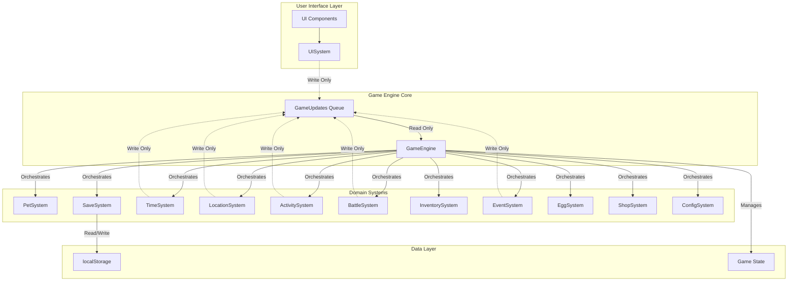
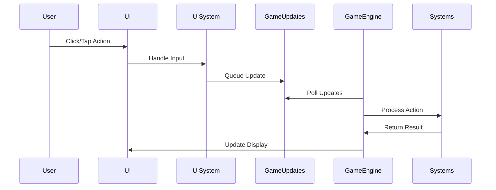
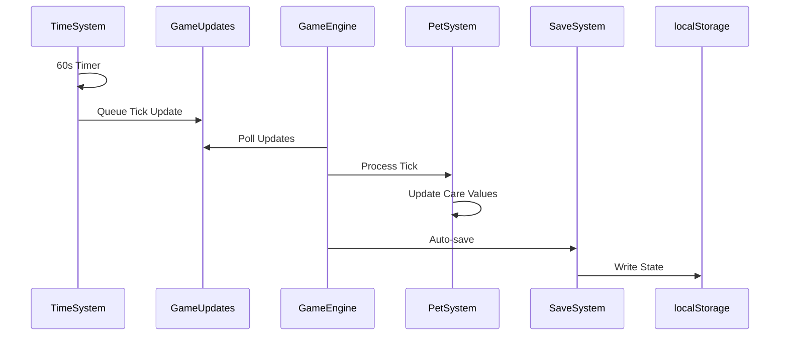
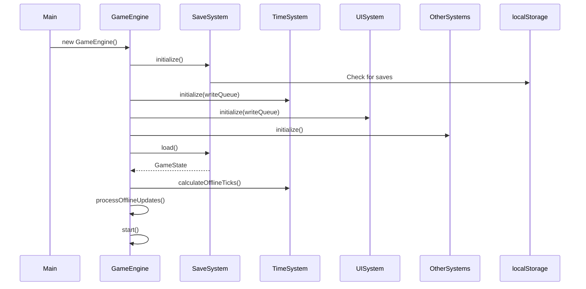

# Digital Pet Game - Software Architecture

## Overview

This document defines the software architecture for the Digital Pet Game, implementing a clean, modular design with isolated systems, centralized orchestration through a GameEngine, and asynchronous communication via a GameUpdates queue.

## Core Architecture Principles

1. **System Isolation**: Each system owns its domain and cannot directly communicate with other systems
2. **Centralized Orchestration**: GameEngine acts as the sole orchestrator and coordinator
3. **Queue-Based Communication**: Systems communicate with GameEngine through a GameUpdates queue
4. **Single Responsibility**: Each system has a clear, well-defined responsibility
5. **Deterministic Processing**: GameEngine processes updates sequentially for predictable behavior

## High-Level Architecture



## Component Definitions

### 1. GameEngine

**Responsibility**: Central orchestrator that owns all systems and processes game updates sequentially.

**Key Functions**:
- Initialize all systems with appropriate write-only access to GameUpdates
- Poll GameUpdates queue and process updates sequentially
- Orchestrate system interactions based on update types
- Maintain game loop and tick processing
- Manage global game state transitions

**Interfaces**:
```typescript
interface GameEngine {
  initialize(): void;
  start(): void;
  stop(): void;
  processUpdate(update: GameUpdate): void;
  tick(): void;
}
```

### 2. GameUpdates Queue

**Responsibility**: Intermediate communication channel between systems and GameEngine. Uses a simple FIFO (First-In-First-Out) queue structure.

**Key Functions**:
- Queue game updates from authorized systems (UISystem, TimeSystem, ActivitySystem, BattleSystem, EventSystem, LocationSystem)
- Provide read-only access to GameEngine
- Maintain update order (FIFO)
- Handle update validation

**Update Types**:
```typescript
const UPDATE_TYPES = {
  USER_ACTION: 'USER_ACTION',           // UI-initiated actions
  GAME_TICK: 'GAME_TICK',              // Time system tick
  ACTIVITY_COMPLETE: 'ACTIVITY_COMPLETE', // Activity completion
  BATTLE_ACTION: 'BATTLE_ACTION',       // Battle system updates
  EVENT_TRIGGER: 'EVENT_TRIGGER',       // Calendar event triggers
  SAVE_REQUEST: 'SAVE_REQUEST',         // Save state request
  STATE_TRANSITION: 'STATE_TRANSITION'   // Major state changes
} as const;

type UpdateType = typeof UPDATE_TYPES[keyof typeof UPDATE_TYPES];

interface GameUpdate {
  id: string;
  type: UpdateType;
  timestamp: number;
  payload: any;
  priority: number;
}
```

### 3. SaveSystem

**Responsibility**: Manage save states, handle localStorage operations, and rotate saves.

**Key Functions**:
- Write save states to localStorage
- Retrieve and validate saves from localStorage
- Implement save rotation (maintain last N saves)
- Handle save export/import as JSON
- Perform save migrations for version updates
- Auto-save on game ticks

**Data Management**:
```typescript
interface SaveSystem {
  save(state: GameState): void;
  load(): GameState | null;
  exportSave(): string;
  importSave(data: string): boolean;
  rotateSaves(): void;
  getBackupSaves(): SaveState[];
}

interface SaveState {
  version: string;
  timestamp: number;
  checksum: string;
  data: GameState;
}
```

### 4. PetSystem

**Responsibility**: Manage pet state, care values, growth stages, and wellness.

**Key Functions**:
- Track and update care values (Satiety, Hydration, Happiness) - computed from tick counters
- Manage hidden Life value and tick counters
- Handle growth stage transitions
- Process feeding, drinking, playing actions
- Calculate care decay over time
- Manage pet death and revival (death from neglect only, not battle)

**State Management**:
```typescript
interface PetSystem {
  updateCareValues(ticks: number): void;
  feed(item: FoodItem): void;
  drink(item: DrinkItem): void;
  play(toy: ToyItem): void;
  cleanPoop(): void;
  checkGrowthStage(): boolean;
  advanceStage(): void;
  calculateLife(): number;
}
```

### 5. TimeSystem

**Responsibility**: Manage game time, ticks, and offline catch-up calculations.

**Key Functions**:
- Generate game ticks (60-second intervals)
- Calculate offline time and generate catch-up updates
- Manage real-time clock synchronization
- Track activity durations and timers
- Write tick updates to GameUpdates queue

**Time Management**:

**Time Management**:
```typescript
interface TimeSystem {
  start(): void;
  stop(): void;
  getCurrentTick(): number;
  calculateOfflineTicks(lastSave: number): number;
  registerTimer(id: string, duration: number, callback: () => void): void;
  cancelTimer(id: string): void;
}
```

### 6. LocationSystem

**Responsibility**: Manage pet location, travel mechanics, and location-based features.

**Key Functions**:
- Track current location
- Calculate travel times and energy costs
- Handle intra-city and inter-city movement
- Manage location-specific activities
- Process travel interruptions and resumption
- Write travel completion updates to GameUpdates queue

### 7. ActivitySystem

**Responsibility**: Manage all pet activities (fishing, foraging, mining, training).

**Key Functions**:
- Start and cancel activities
- Calculate activity durations and energy costs
- Determine activity outcomes and rewards
- Handle activity interruptions
- Manage tool requirements and durability
- Write activity completion updates to GameUpdates queue

### 8. BattleSystem

**Responsibility**: Handle all combat mechanics and battle flow.

**Key Functions**:
- Initialize battles from various triggers
- Manage turn order and action resolution
- Calculate damage and apply effects
- Handle move selection and action costs
- Process battle outcomes and rewards
- Manage battle interruptions
- Write battle completion updates to GameUpdates queue

### 9. InventorySystem

**Responsibility**: Manage items, currency, and inventory operations.

**Key Functions**:
- Add/remove items from inventory
- Handle item stacking and limits
- Manage currency transactions
- Process item usage and effects
- Handle tool durability
- Manage inventory sorting and filtering

### 10. EventSystem

**Responsibility**: Manage calendar events and time-based content.

**Key Functions**:
- Check event availability based on real-time
- Handle event participation and closure
- Manage event-specific activities and battles
- Process event rewards and token conversion
- Handle graceful event termination
- Write event trigger updates to GameUpdates queue

### 11. UISystem

**Responsibility**: Bridge between UI components and game engine via GameUpdates.

**Key Functions**:
- Translate user interactions into GameUpdates
- Render game state to UI components
- Handle input validation
- Manage UI notifications and modals
- Process accessibility settings

### 12. EggSystem

**Responsibility**: Manage egg incubation, hatching mechanics, and species determination.

**Key Functions**:
- Track egg incubation timers
- Process real-time incubation during offline periods
- Handle hatching and species rolling based on egg type
- Manage rarity-weighted outcomes
- Interface with InventorySystem for egg items
- Generate starter selection when no pets/eggs exist

**Egg Management**:
```typescript
interface EggSystem {
  startIncubation(eggItem: Item): void;
  checkIncubationStatus(eggId: string): IncubationStatus;
  hatchEgg(eggId: string): Pet;
  rollSpecies(eggType: EggType): Species;
  getStarterOptions(): Species[];
  processOfflineIncubation(ticks: number): void;
}
```

### 13. ShopSystem

**Responsibility**: Manage shop inventory and purchase transactions as a stateless service.

**Key Functions**:
- Generate daily shop inventory
- Calculate item prices based on rarity
- Process purchase transactions
- Apply event discounts
- Validate currency requirements
- Interface with InventorySystem for item transfers

**Shop Operations**:
```typescript
interface ShopSystem {
  getDailyInventory(seed: number): ShopItem[];
  purchaseItem(itemId: string, quantity: number): boolean;
  sellItem(item: Item, quantity: number): number;
  getItemPrice(item: Item): number;
  applyDiscount(price: number, eventId?: string): number;
}
```

### 14. ConfigSystem

**Responsibility**: Centralized configuration and tuning value management.

**Key Functions**:
- Load game configuration from static sources
- Provide tuning values for all systems
- Manage feature flags
- Handle configuration versioning
- Cache frequently accessed values

**Configuration Management**:
```typescript
interface ConfigSystem {
  load(): GameConfig;
  get(key: string): any;
  getTuningValues(): TuningConfig;
  getFeatureFlags(): FeatureFlags;
  getCareDecayRates(): CareDecayConfig;
  getActivityRewards(activityType: string): RewardConfig;
  getBattleFormulas(): BattleConfig;
}

interface TuningConfig {
  careDecay: {
    satietyPerHour: number;
    hydrationPerHour: number;
    happinessPerHour: number;
  };
  energy: {
    maxByStage: { [key: string]: number };
    sleepRegenRate: number;
  };
  activities: {
    [activityType: string]: {
      duration: number;
      energyCost: number;
      rewards: RewardRange;
    };
  };
}
```

## Data Flow Patterns

### User-Initiated Action Flow



### Game Tick Flow



## State Management

### Game State Structure

```typescript
interface GameState {
  version: string;
  timestamp: number;
  
  pet: {
    species: string;
    rarity: Rarity;
    stage: GrowthStage;
    stats: BattleStats;
    energy: number;
    // Note: careValues are computed from hiddenCounters, not stored
    hiddenCounters: {
      satietyTicks: number;
      hydrationTicks: number;
      happinessTicks: number;
      lifeTicks: number;
    };
    statuses: Status[];
    moves: Move[];
    poopCount: number;
  };
  
  inventory: {
    items: Item[];  // Includes all items: consumables, tools with durability, etc.
    currency: number;
  };
  
  world: {
    currentLocation: Location;
    activeTimers: Timer[];
    eventParticipation: EventRef[];
  };
  
  meta: {
    settings: Settings;
    tutorialProgress: string[];
    memorialLog: Memorial[];
  };
}
```

## System Initialization Sequence



## Error Handling Strategy

### System-Level Error Handling

Each system implements its own error boundaries:
- **SaveSystem**: Handles corrupted saves with rollback capability
- **TimeSystem**: Handles clock drift and invalid timestamps
- **BattleSystem**: Handles invalid move selections and state corruption
- **InventorySystem**: Handles inventory overflow and invalid items

### Global Error Recovery

```typescript
interface ErrorRecovery {
  handleSystemError(system: string, error: Error): void;
  rollbackToLastStableState(): void;
  notifyUser(message: string): void;
  logError(error: Error, context: any): void;
}
```

## Performance Considerations

### Optimization Strategies

1. **Batch Updates**: Group multiple updates in the same tick
2. **Lazy Loading**: Load systems on-demand for better initial performance
3. **State Diffing**: Only save changed portions of state
4. **Throttling**: Limit update frequency for non-critical systems
5. **Web Workers**: Consider moving TimeSystem to a worker thread

### Memory Management

- Implement save rotation to limit localStorage usage
- Clear expired timers and completed activities
- Limit battle history and event logs
- Implement item stack limits

## Testing Strategy

### Unit Testing
- Test each system in isolation with mock GameUpdates
- Test update processing logic in GameEngine
- Test save/load functionality with various state scenarios

### Integration Testing
- Test system interactions through GameEngine
- Test complete user flows from UI to persistence
- Test offline catch-up with various time gaps

### Performance Testing
- Test with maximum inventory and pet stats
- Test with extended offline periods (30+ days)
- Test save/load performance with large states

## Security Considerations

### Client-Side Security
- Validate all save imports with checksums
- Sanitize user inputs before processing
- Implement rate limiting for actions
- Store sensitive calculations server-side (future consideration)

### Data Integrity
- Use checksums for save validation
- Implement version checking for save compatibility
- Log suspicious activity patterns
- Prevent save manipulation through validation

## Future Extensibility

### Planned Extensions
1. **Achievement System**: Track player accomplishments
2. **Collection System**: Manage multiple pets (storage only)
3. **Customization System**: Pet accessories and decorations
4. **Social System**: Share pet snapshots (no multiplayer)
5. **Analytics System**: Track gameplay metrics locally

### System Addition Protocol
1. Create new system implementing base System interface
2. Register with GameEngine during initialization
3. Define update types for GameUpdates
4. Implement state management within system domain
5. Add system state to GameState structure
6. Update SaveSystem to handle new state

## Deployment Architecture

### Build Configuration
- TypeScript compilation with strict mode
- Bundle optimization with tree-shaking
- Asset optimization (sprites, sounds)
- Progressive Web App manifest

### Browser Compatibility
- Target ES2020 for modern browsers
- Polyfills for localStorage where needed
- Graceful degradation for older browsers
- Feature detection for advanced APIs

## Conclusion

This architecture provides a robust, scalable foundation for the Digital Pet Game with clear separation of concerns, predictable data flow, and excellent maintainability. The isolated system design ensures that changes to one system don't cascade throughout the codebase, while the central orchestration pattern maintains consistency and control over game state.