# Digital Pet Game Architecture

## Table of Contents
1. [Architecture Overview](#architecture-overview)
2. [Core Components](#core-components)
3. [Component Details](#component-details)
4. [Data Flow and Interactions](#data-flow-and-interactions)
5. [Implementation Notes](#implementation-notes)

## Architecture Overview

The Digital Pet game is built around a central GameEngine that coordinates all game systems. The architecture follows a component-based design with clear separation of concerns, event-driven communication, and deterministic state management suitable for a client-only HTML5 game.

### High-Level Architecture Diagram


## Core Components

### 1. GameEngine

**Role**: Central coordinator that manages the game loop, orchestrates all subsystems, and ensures proper initialization and shutdown sequences.

**Key Responsibilities**:
- Initialize all game systems in correct order
- Manage the main game loop and tick system
- Coordinate cross-system interactions
- Handle global game state transitions
- Trigger autosaves on ticks and user actions

**Functions**:
```typescript
class GameEngine {
    // Initialization
    initialize(): Promise<void>
    loadGameState(): Promise<GameState>
    setupSystems(): void
    
    // Game Loop
    startGameLoop(): void
    stopGameLoop(): void
    tick(): void  // Called every 60 seconds
    update(deltaTime: number): void  // Frame updates for UI
    
    // System Management
    registerSystem(system: GameSystem): void
    getSystem<T extends GameSystem>(type: SystemType): T
    
    // State Management
    triggerAutosave(reason: AutosaveReason): Promise<void>
    handleStateChange(change: StateChange): void
    
    // Lifecycle
    pause(): void
    resume(): void
    shutdown(): Promise<void>
}
```

### 2. TimeManager

**Role**: Manages all time-related operations including real-time tracking, offline catch-up, and tick scheduling.

**Key Responsibilities**:
- Track real-time using device clock
- Calculate offline time on resume
- Manage game ticks (60-second intervals)
- Handle time-based event scheduling
- Process offline catch-up calculations

**Functions**:
```typescript
class TimeManager {
    // Time Tracking
    getCurrentTime(): Date
    getLastSaveTime(): Date
    getElapsedTime(): number
    getOfflineTime(): number
    
    // Tick Management
    startTicking(): void
    stopTicking(): void
    registerTickHandler(handler: TickHandler): void
    processTick(): void
    
    // Offline Processing
    calculateOfflineTicks(offlineSeconds: number): number
    processOfflineTime(offlineSeconds: number): OfflineUpdate
    
    // Scheduling
    scheduleEvent(time: Date, callback: Function): EventHandle
    cancelScheduledEvent(handle: EventHandle): void
    
    // Time Utilities
    formatTimeRemaining(seconds: number): string
    getLocalTimezone(): string
    convertToLocalTime(utcTime: Date): Date
}
```

### 3. StateManager

**Role**: Centralized state management system that maintains the entire game state and handles state mutations.

**Key Responsibilities**:
- Maintain single source of truth for game state
- Process state mutations through actions
- Emit state change events
- Provide state snapshots for saves
- Handle state validation

**Functions**:
```typescript
class StateManager {
    // State Access
    getState(): GameState
    getPetState(): PetState
    getInventoryState(): InventoryState
    getWorldState(): WorldState
    
    // State Mutations
    dispatch(action: GameAction): void
    batchDispatch(actions: GameAction[]): void
    
    // State Validation
    validateState(state: Partial<GameState>): ValidationResult
    sanitizeState(state: GameState): GameState
    
    // Subscriptions
    subscribe(listener: StateListener): Unsubscribe
    subscribeToPath(path: string, listener: StateListener): Unsubscribe
    
    // Snapshots
    createSnapshot(): StateSnapshot
    restoreSnapshot(snapshot: StateSnapshot): void
    
    // Transactions
    beginTransaction(): void
    commitTransaction(): void
    rollbackTransaction(): void
}
```

### 4. EventManager

**Role**: Manages event-driven communication between systems using a publish-subscribe pattern.

**Key Responsibilities**:
- Handle event registration and dispatching
- Manage event listeners
- Process event queues
- Handle priority events
- Log event history for debugging

**Functions**:
```typescript
class EventManager {
    // Event Publishing
    emit(event: GameEvent): void
    emitAsync(event: GameEvent): Promise<void>
    emitDelayed(event: GameEvent, delayMs: number): void
    
    // Event Subscription
    on(eventType: EventType, handler: EventHandler): Unsubscribe
    once(eventType: EventType, handler: EventHandler): Unsubscribe
    off(eventType: EventType, handler: EventHandler): void
    
    // Event Queue
    queueEvent(event: GameEvent): void
    processEventQueue(): void
    clearEventQueue(): void
    
    // Priority Events
    registerPriorityHandler(eventType: EventType, handler: EventHandler): void
    
    // Event History
    getEventHistory(limit: number): GameEvent[]
    clearEventHistory(): void
}
```

## Component Details

### Pet Systems

#### PetSystem

**Role**: Core system managing all pet-related functionality and coordinating pet subsystems.

**Functions**:
```typescript
class PetSystem {
    // Pet Lifecycle
    createPet(species: Species, fromEgg?: Egg): Pet
    activatePet(pet: Pet): void
    deactivatePet(): void
    handlePetDeath(cause: DeathCause): void
    
    // Pet State
    getPet(): Pet | null
    updatePetState(updates: Partial<PetState>): void
    
    // Subsystem Coordination
    processCare(): void
    processGrowth(): void
    processStatus(): void
    
    // Offline Processing
    processOfflineUpdates(ticks: number): void
}
```

#### CareSystem

**Role**: Manages pet care values including satiety, hydration, happiness, and hidden life stat.

**Functions**:
```typescript
class CareSystem {
    // Care Values
    getSatiety(): number
    getHydration(): number
    getHappiness(): number
    getLife(): number  // Hidden value
    
    // Care Ticks (Hidden)
    getSatietyTicks(): number
    getHydrationTicks(): number
    getHappinessTicks(): number
    
    // Care Updates
    feed(foodItem: FoodItem): void
    drink(drinkItem: DrinkItem): void
    play(toy: ToyItem): void
    
    // Tick Processing
    processCareDecay(ticks: number): void
    calculateDisplayValue(ticks: number, multiplier: number): number
    
    // Life Management
    updateLife(delta: number): void
    checkLifeStatus(): LifeStatus
    
    // Poop System
    spawnPoop(): void
    cleanPoop(amount?: number): void
    getPoopCount(): number
    calculatePoopSpawnChance(hours: number): boolean
}
```

#### GrowthSystem

**Role**: Manages pet growth stages and stage advancement mechanics.

**Functions**:
```typescript
class GrowthSystem {
    // Stage Management
    getCurrentStage(): GrowthStage
    getStageProgress(): StageProgress
    checkAdvancementEligibility(): boolean
    advanceStage(): void
    
    // Stage Effects
    getMaxEnergy(): number
    getSleepRegenRate(): number
    getActivityAccess(): ActivityType[]
    
    // Stage Timers
    getTimeInStage(): number
    getMinimumStageTime(): number
    isStageTimeRequirementMet(): boolean
    
    // Stat Bonuses
    applyStageAdvancementBonuses(): void
}
```

#### StatusSystem

**Role**: Manages pet status conditions including sickness and injuries.

**Functions**:
```typescript
class StatusSystem {
    // Status Checks
    isSick(): boolean
    isInjured(): boolean
    getActiveStatuses(): Status[]
    
    // Status Application
    applySickness(severity: SicknessSeverity): void
    applyInjury(type: InjuryType): void
    
    // Status Treatment
    treatSickness(medicine: MedicineItem): void
    treatInjury(bandage: BandageItem): void
    
    // Status Effects
    getStatusEffects(): StatusEffect[]
    processStatusTick(): void
    
    // Status Chances
    calculateSicknessChance(poopCount: number): number
    calculateInjuryChance(activity: Activity): number
}
```

### Activity Systems

#### ActivitySystem

**Role**: Coordinates all pet activities including travel, training, and resource gathering.

**Functions**:
```typescript
class ActivitySystem {
    // Activity Management
    startActivity(activity: Activity): void
    cancelActivity(): void
    getCurrentActivity(): Activity | null
    isActivityInProgress(): boolean
    
    // Activity Validation
    canStartActivity(activity: Activity): ValidationResult
    checkEnergyCost(activity: Activity): boolean
    checkConcurrencyRules(activity: Activity): boolean
    
    // Activity Processing
    processActivityTick(): void
    completeActivity(): void
    
    // Activity Outcomes
    calculateRewards(activity: Activity): Reward[]
    calculateRisks(activity: Activity): Risk[]
    
    // Offline Processing
    processOfflineActivity(seconds: number): ActivityResult
}
```

#### TravelSystem

**Role**: Manages location-based travel including instant intra-city and timed inter-city movement.

**Functions**:
```typescript
class TravelSystem {
    // Travel Management
    startTravel(destination: Location): void
    cancelTravel(): void
    getCurrentTravel(): Travel | null
    
    // Travel Types
    performIntraCityMove(area: CityArea): void
    startInterCityTravel(city: City, energyCost: number): void
    startWildTravel(biome: Biome, energyCost: number): void
    
    // Travel Calculations
    calculateTravelTime(from: Location, to: Location): number
    calculateEnergyCost(distance: DistanceTier): number
    applyTravelModifiers(baseTime: number): number
    
    // Travel Progress
    getTravelProgress(): number
    getRemainingTime(): number
    completeTravel(): void
    
    // Concurrent Actions
    canPerformWhileTraveling(action: ActionType): boolean
}
```

#### TrainingSystem

**Role**: Manages stat training sessions and move learning mechanics.

**Functions**:
```typescript
class TrainingSystem {
    // Training Sessions
    startTraining(stat: BattleStat): void
    cancelTraining(): void
    getCurrentTraining(): Training | null
    
    // Stat Training
    trainHealth(): void
    trainAttack(): void
    trainDefense(): void
    trainSpeed(): void
    trainAction(): void
    
    // Training Progress
    calculateStatGain(stat: BattleStat): number
    applyStatIncrease(stat: BattleStat, amount: number): void
    
    // Move Learning
    checkMoveLearnChance(): boolean
    generateNewMove(trainingStat: BattleStat): Move
    learnMove(move: Move): void
    replaceMove(oldMove: Move, newMove: Move): void
    
    // Training Validation
    canTrain(): boolean
    getTrainingEnergyCost(): number
}
```

#### BattleSystem

**Role**: Manages turn-based battles including wild encounters and arena events.

**Functions**:
```typescript
class BattleSystem {
    // Battle Management
    startBattle(opponent: BattleOpponent): void
    endBattle(outcome: BattleOutcome): void
    getCurrentBattle(): Battle | null
    
    // Turn Management
    processTurn(): void
    determineTurnOrder(): Combatant[]
    executeTurn(combatant: Combatant): void
    
    // Player Actions
    useMove(move: Move): void
    useItem(item: BattleItem): void
    attemptFlee(): boolean
    skipTurn(): void  // Restores Action
    
    // Move Execution
    calculateDamage(move: Move, attacker: Combatant, defender: Combatant): number
    applyStatusEffect(effect: StatusEffect, target: Combatant): void
    checkAccuracy(move: Move): boolean
    consumeAction(cost: number): boolean
    restoreAction(amount: number): void
    
    // Battle State
    checkFaintCondition(combatant: Combatant): boolean
    processVictory(): void
    processDefeat(): void
    
    // Battle Interruption
    pauseBattle(): void
    resumeBattle(): void
}
```

### World Systems

#### LocationSystem

**Role**: Manages game world locations including cities, wild biomes, and areas within locations.

**Functions**:
```typescript
class LocationSystem {
    // Location Management
    getCurrentLocation(): Location
    setLocation(location: Location): void
    getAvailableLocations(): Location[]
    
    // Location Types
    getCities(): City[]
    getWildBiomes(): Biome[]
    getCityAreas(city: City): CityArea[]
    
    // Location Features
    getLocationActivities(location: Location): Activity[]
    getLocationShops(location: Location): Shop[]
    getLocationEvents(location: Location): Event[]
    
    // Distance Calculations
    calculateDistance(from: Location, to: Location): DistanceTier
    getNeighboringLocations(location: Location): Location[]
    
    // Location Validation
    canAccessLocation(location: Location): boolean
    checkLocationRequirements(location: Location): Requirement[]
}
```

#### EventSystem

**Role**: Manages calendar-based events and special time-limited activities.

**Functions**:
```typescript
class EventSystem {
    // Event Management
    getActiveEvents(): CalendarEvent[]
    getUpcomingEvents(): CalendarEvent[]
    checkEventAvailability(): void
    
    // Event Participation
    joinEvent(event: CalendarEvent): void
    leaveEvent(): void
    getCurrentEvent(): CalendarEvent | null
    
    // Event Scheduling
    scheduleEvent(event: CalendarEvent): void
    isEventOpen(event: CalendarEvent): boolean
    getEventTimeWindow(event: CalendarEvent): TimeWindow
    
    // Event Closure
    handleEventClosure(): void
    distributePartialRewards(): void
    convertEventTokens(): number
    
    // Event Types
    processArenaEvent(): void
    processTournamentEvent(): void
    processSeasonalEvent(): void
}
```

#### ItemSystem

**Role**: Manages inventory, item usage, and item effects.

**Functions**:
```typescript
class ItemSystem {
    // Inventory Management
    getInventory(): Inventory
    addItem(item: Item, quantity: number): void
    removeItem(item: Item, quantity: number): void
    getItemCount(item: Item): number
    
    // Item Usage
    useItem(item: Item): void
    canUseItem(item: Item): boolean
    applyItemEffect(item: Item, target: any): void
    
    // Item Categories
    getFoodItems(): FoodItem[]
    getDrinkItems(): DrinkItem[]
    getToyItems(): ToyItem[]
    getMedicineItems(): MedicineItem[]
    getToolItems(): ToolItem[]
    
    // Item Properties
    isStackable(item: Item): boolean
    getStackLimit(item: Item): number
    getItemDurability(item: Item): number
    reduceDurability(item: Item, amount: number): void
    
    // Inventory Operations
    sortInventory(sortType: SortType): void
    filterInventory(category: ItemCategory): Item[]
}
```

#### ShopSystem

**Role**: Manages shop inventories, purchases, and daily rotations.

**Functions**:
```typescript
class ShopSystem {
    // Shop Management
    getShopInventory(shop: Shop): ShopInventory
    refreshShopInventory(shop: Shop): void
    getNextRotationTime(): Date
    
    // Purchasing
    purchaseItem(item: Item, quantity: number): PurchaseResult
    canAffordItem(item: Item, quantity: number): boolean
    calculatePrice(item: Item, quantity: number): number
    
    // Currency
    getCoins(): number
    spendCoins(amount: number): void
    addCoins(amount: number): void
    
    // Shop Features
    applyDiscount(price: number, discount: Discount): number
    getActiveDiscounts(): Discount[]
    checkSpecialOffers(): SpecialOffer[]
    
    // Egg Shop
    getAvailableEggs(): Egg[]
    purchaseEgg(egg: Egg): void
}
```

### UI Systems

#### UIManager

**Role**: Coordinates all UI components and manages UI state updates.

**Functions**:
```typescript
class UIManager {
    // UI Initialization
    initialize(): void
    setupEventListeners(): void
    loadUIAssets(): Promise<void>
    
    // Screen Management
    showScreen(screen: Screen): void
    hideScreen(screen: Screen): void
    getCurrentScreen(): Screen
    
    // UI Updates
    update(deltaTime: number): void
    render(): void
    
    // Modal Management
    showModal(modal: Modal): void
    hideModal(modal: Modal): void
    
    // UI State
    setUIState(state: UIState): void
    getUIState(): UIState
    
    // Responsive Design
    handleResize(): void
    getViewportSize(): ViewportSize
    adjustForMobile(): void
}
```

#### HUDController

**Role**: Manages the heads-up display showing pet status and current activities.

**Functions**:
```typescript
class HUDController {
    // HUD Elements
    updatePetPortrait(pet: Pet): void
    updateEnergyBar(current: number, max: number): void
    updateCareBar(type: CareType, value: number): void
    updateHealthBar(current: number, max: number): void  // Battle only
    
    // Status Icons
    showStatusIcon(status: Status): void
    hideStatusIcon(status: Status): void
    updatePoopCount(count: number): void
    
    // Location Display
    updateLocationBreadcrumbs(location: Location): void
    showTravelETA(remainingTime: number): void
    
    // Activity Display
    showActivityProgress(activity: Activity, progress: number): void
    showCancelButton(canCancel: boolean): void
    
    // Context Actions
    updateActionPanel(actions: Action[]): void
    enableAction(action: Action): void
    disableAction(action: Action): void
}
```

#### NotificationSystem

**Role**: Manages in-game notifications including toasts, alerts, and modals.

**Functions**:
```typescript
class NotificationSystem {
    // Toast Notifications
    showToast(message: string, type: ToastType): void
    hideToast(id: string): void
    queueToast(toast: Toast): void
    
    // Alert Management
    showAlert(alert: Alert): void
    showLowCareAlert(careType: CareType): void
    showHighPoopAlert(): void
    
    // Modal Notifications
    showBattleSummary(result: BattleResult): void
    showEventClosure(event: CalendarEvent): void
    showRewardModal(rewards: Reward[]): void
    
    // Notification Settings
    setNotificationPreferences(prefs: NotificationPrefs): void
    isNotificationEnabled(type: NotificationType): boolean
    
    // Notification Queue
    processNotificationQueue(): void
    clearNotificationQueue(): void
}
```

#### AccessibilityController

**Role**: Manages accessibility features and settings.

**Functions**:
```typescript
class AccessibilityController {
    // Visual Accessibility
    setColorBlindMode(mode: ColorBlindMode): void
    enableHighContrast(): void
    setFontScale(scale: number): void
    toggleReducedMotion(): void
    
    // Input Accessibility
    setupKeyboardShortcuts(): void
    handleKeyboardNavigation(key: KeyCode): void
    setFocusOutlines(visible: boolean): void
    
    // Screen Reader Support
    updateAriaLabels(): void
    announceScreenChange(screen: Screen): void
    setLiveRegion(message: string): void
    
    // Settings Management
    loadAccessibilitySettings(): void
    saveAccessibilitySettings(): void
    resetToDefaults(): void
}
```

### Persistence Systems

#### PersistenceManager

**Role**: Coordinates all save/load operations and manages data persistence.

**Functions**:
```typescript
class PersistenceManager {
    // Save Operations
    save(state: GameState): Promise<void>
    autosave(reason: AutosaveReason): Promise<void>
    quicksave(): Promise<void>
    
    // Load Operations
    load(): Promise<GameState>
    loadBackup(backupId: string): Promise<GameState>
    
    // Export/Import
    exportSave(): Promise<SaveFile>
    importSave(file: SaveFile): Promise<void>
    validateSaveFile(file: SaveFile): ValidationResult
    
    // Storage Management
    getStorageUsage(): number
    clearOldSaves(): void
    compressSave(state: GameState): CompressedSave
    
    // Migration
    migrateOldSave(oldSave: any): GameState
    getCurrentSaveVersion(): string
}
```

#### SaveManager

**Role**: Handles low-level save operations using IndexedDB.

**Functions**:
```typescript
class SaveManager {
    // Database Operations
    openDatabase(): Promise<IDBDatabase>
    createTransaction(mode: IDBTransactionMode): IDBTransaction
    
    // Save Operations
    writeSave(key: string, data: any): Promise<void>
    readSave(key: string): Promise<any>
    deleteSave(key: string): Promise<void>
    
    // Batch Operations
    batchWrite(saves: SaveData[]): Promise<void>
    getAllSaves(): Promise<SaveData[]>
    
    // IndexedDB Management
    upgradeDatabase(oldVersion: number, newVersion: number): void
    handleQuotaExceeded(): void
    
    // Checksums
    generateChecksum(data: any): string
    verifyChecksum(data: any, checksum: string): boolean
}
```

#### BackupManager

**Role**: Manages automatic backups and recovery operations.

**Functions**:
```typescript
class BackupManager {
    // Backup Creation
    createBackup(state: GameState): Promise<string>
    createRollingBackup(): void
    scheduleAutoBackup(): void
    
    // Backup Management
    listBackups(): Promise<Backup[]>
    getBackup(backupId: string): Promise<Backup>
    deleteBackup(backupId: string): Promise<void>
    
    // Backup Rotation
    rotateBackups(maxBackups: number): void
    getOldestBackup(): Promise<Backup>
    
    // Recovery
    restoreFromBackup(backupId: string): Promise<GameState>
    findLastValidBackup(): Promise<Backup>
    
    // Backup Validation
    validateBackup(backup: Backup): boolean
    repairCorruptedBackup(backup: Backup): Backup | null
}
```

## Data Flow and Interactions

### Game Initialization Flow


### Game Tick Flow


### User Action Flow (Feed Pet)

```mermaid
sequenceDiagram
    participant UI as UI
    participant GE as GameEngine
    participant IS as ItemSystem
    participant CS as CareSystem
    participant SM as StateManager
    participant PM as PersistenceManager
    
    UI->>GE: feedPet(foodItem)
    GE->>IS: canUseItem(foodItem)
    IS-->>GE: true
    GE->>CS: feed(foodItem)
    CS->>CS: addSatietyTicks()
    CS->>SM: dispatch(UPDATE_SATIETY)
    GE->>IS: removeItem(foodItem, 1)
    GE->>PM: autosave(USER_ACTION)
    UI->>UI: updateHUD()
```



### Battle Flow


### Offline Catch-up Flow


## Implementation Notes

### Critical Design Decisions

1. **Tick-Based System**: The 60-second tick serves as the primary update mechanism for care decay and autosaves. However, user actions trigger immediate autosaves to prevent data loss.

2. **Hidden Tick Counters**: Care values use hidden tick counters for precise calculations. Display values are computed from ticks using multipliers (e.g., 1 Hydration = 15 ticks = 15 minutes).

3. **Offline Processing**: All offline calculations are deterministic and batched into a single update to maintain consistency and performance.

4. **State Management**: Single source of truth pattern with immutable updates ensures predictable state changes and easy debugging.

5. **Event-Driven Architecture**: Loose coupling between systems through events allows for flexible feature additions and modifications.

### Performance Considerations

1. **Lazy Loading**: Load only necessary assets and systems based on current game state.

2. **Object Pooling**: Reuse UI elements and game objects to reduce garbage collection.

3. **Batch Updates**: Group multiple state changes into single update cycles.

4. **Efficient Offline Processing**: Calculate offline updates mathematically rather than simulating each tick.

5. **IndexedDB Transactions**: Use batch writes and transactions for save operations.

### Error Handling Strategy

1. **Graceful Degradation**: If a system fails, disable related features rather than crashing.

2. **Automatic Recovery**: Maintain rolling backups and attempt recovery from last valid state.

3. **User Notification**: Clear error messages with suggested actions for users.

4. **Logging System**: Comprehensive logging for debugging without exposing internals to users.

### Extensibility Points

1. **Plugin System**: Systems can register handlers for specific events without modifying core code.

2. **Data-Driven Content**: Species, items, activities defined in configuration files.

3. **Tuning Parameters**: All gameplay values exposed through configuration for easy balancing.

4. **Custom Events**: Calendar events can be added without code changes.

5. **Modular UI Components**: UI elements can be swapped or themed independently.

### Security Considerations

1. **Save Validation**: Checksums and version checks prevent corrupted or tampered saves.

2. **Input Sanitization**: All user inputs validated before processing.

3. **Resource Limits**: Caps on inventory, stats, and other values to prevent overflow.

4. **No External Dependencies**: Fully offline operation eliminates network attack vectors.